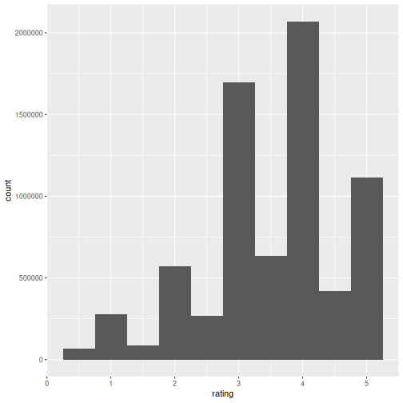
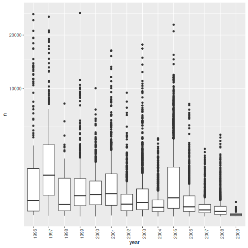
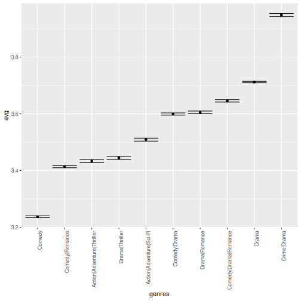
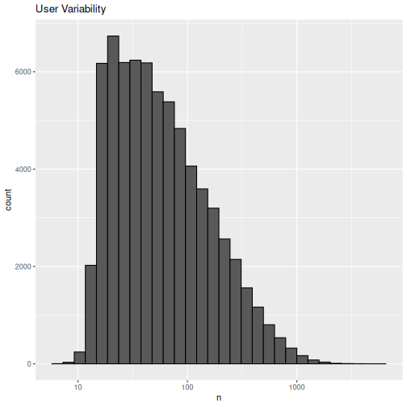
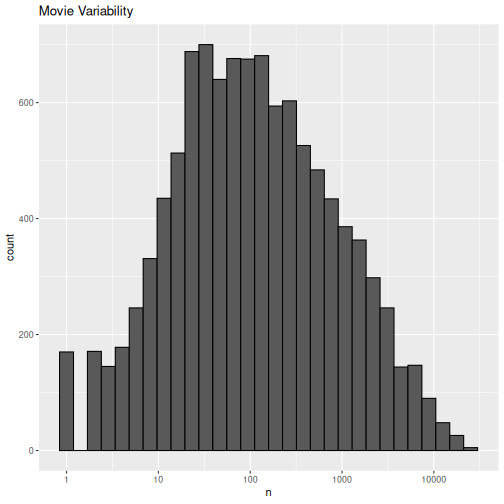
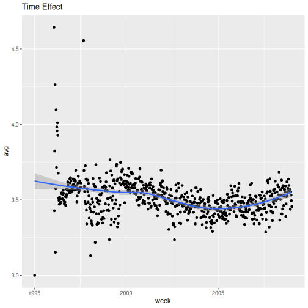

# BUILDING A MOVIE RECOMMENDATION SYSTEM


## 1. Introduction

This project focuses on creating a movie recommendation system using the **MovieLens 10M Dataset**, which can be accessed from [GroupLens Research](https://grouplens.org/datasets/movielens/). The primary objective is to analyze the dataset, uncover patterns through visualization, and develop a model that delivers optimal movie recommendations to users.

**Key steps undertaken:**
1. Preparation of the work environment.
2. Data preparation, exploration, and visualization.
3. Observation analysis.
4. Calculation of the optimal RMSE using movieId and userId.

Following these steps, our model identified movieId and userId as the most effective predictors, achieving an **RMSE of 0.84**.


## 2. Methods and Analysis

### 2.1 Work Environment Preparation
The following R libraries were used:
- `tidyverse` – Data manipulation and visualization
- `caret` – Model training and evaluation

  
The dataset was downloaded directly from the GroupLens site.

``` r
dl <- tempfile()
download.file("http://files.grouplens.org/datasets/movielens/ml-10m.zip", dl)
```


### 2.2 Data Wrangling
The MovieLens data was processed into a structured dataset for modeling:

``` r
ratings <- fread(text = gsub("::", "\t", readLines(unzip(dl, "ml-10M100K/ratings.dat"))),
                 col.names = c("userId", "movieId", "rating", "timestamp"))

movies <- str_split_fixed(readLines(unzip(dl, "ml-10M100K/movies.dat")), "\\::", 3)
colnames(movies) <- c("movieId", "title", "genres")
movies <- as.data.frame(movies) %>% mutate(movieId = as.integer(movies[, 1]),
                                           title = as.character(title),
                                           genres = as.character(genres))

movielens <- left_join(ratings, movies, by = "movieId")

# Validation set will be 10% of MovieLens data
set.seed(1)
test_index <- createDataPartition(y = movielens$rating, times = 1, p = 0.1, list = FALSE)
train_set <- movielens[-test_index,]
temp <- movielens[test_index,]

test_set <- temp %>% semi_join(train_set, by = "movieId") %>% semi_join(train_set, by = "userId")

removed <- anti_join(temp, test_set)
train_set <- rbind(train_set, removed)

# Add a year column generated from the timestamp column
dates <- as.Date(as.POSIXct(train_set$timestamp, origin="1970-01-01"))
train_set <- train_set %>% mutate(year=year(dates), month=month(dates))
rm(dl, ratings, movies, test_index, temp, movielens, removed, dates)
```

This final dataset (train_set) was used for all subsequent analysis and modeling.

### 2.3 Data Exploration and Visualization
Exploratory analysis revealed:
- Total ratings:

``` r
length(train_set$rating)
```

```
## [1] 7200048
```
- Unique movies:

``` r
n_distinct(train_set$movieId)
```

```
## [1] 10643
```
- Unique users:

``` r
n_distinct(train_set$userId)
```

```
## [1] 69878
```

And we can confirm that each user rated a movie using the following code:

``` r
train_set %>% filter(is.na(.$rating)) %>% nrow()
```

```
## [1] 0
```


Key findings:
- Rating distribution was concentrated around certain values.



- Top 20 genres by view count were identified.


```
##                              genres  count
## 1                             Drama 586658
## 2                            Comedy 560619
## 3                    Comedy|Romance 292718
## 4                      Comedy|Drama 258548
## 5              Comedy|Drama|Romance 208883
## 6                     Drama|Romance 207712
## 7           Action|Adventure|Sci-Fi 176066
## 8         Action|Adventure|Thriller 119270
## 9                    Drama|Thriller 116370
## 10                      Crime|Drama 110300
## 11                        Drama|War  88805
## 12             Crime|Drama|Thriller  84518
## 13 Action|Adventure|Sci-Fi|Thriller  83749
## 14            Action|Crime|Thriller  81509
## 15                 Action|Drama|War  79094
## 16                  Action|Thriller  77244
## 17           Action|Sci-Fi|Thriller  76699
## 18                         Thriller  75665
## 19                  Horror|Thriller  60319
## 20                     Comedy|Crime  58731
```

- Top 20 movies by rating frequency were highlighted.


```
##                                                           title count
## 1                                           Pulp Fiction (1994) 25162
## 2                                           Forrest Gump (1994) 24824
## 3                              Silence of the Lambs, The (1991) 24246
## 4                                          Jurassic Park (1993) 23389
## 5                              Shawshank Redemption, The (1994) 22340
## 6                                             Braveheart (1995) 21012
## 7                             Terminator 2: Judgment Day (1991) 20930
## 8                                          Fugitive, The (1993) 20844
## 9  Star Wars: Episode IV - A New Hope (a.k.a. Star Wars) (1977) 20648
## 10                                                Batman (1989) 19409
## 11                                             Apollo 13 (1995) 19338
## 12                                             Toy Story (1995) 19174
## 13                         Independence Day (a.k.a. ID4) (1996) 18784
## 14                                    Dances with Wolves (1990) 18623
## 15                                      Schindler's List (1993) 18531
## 16                                             True Lies (1994) 18231
## 17            Star Wars: Episode VI - Return of the Jedi (1983) 17974
## 18                           12 Monkeys (Twelve Monkeys) (1995) 17610
## 19                                                 Speed (1994) 17176
## 20                                   Usual Suspects, The (1995) 17163
```

- The year **1997** had the highest median number of ratings.



- The **Crime|Drama** genre had the highest average ratings (for genres with over 100,000 ratings).




### 2.4 Data Analysis
Three notable patterns emerged:
1. **User activity variability:** Some users rated over 1,000 movies, while others rated only a few.



2. **Movie popularity variability:** Certain movies received far more ratings than others.



3. **Time effect:** Ratings exhibited trends over time.




### 2.5 Data Modelling
From the observations above, we can then prove that there's indeed a movie variability (b~i~), user variability (b~u~) and a time effect (f(d~u,i~)). We will use these predictors to model the data. The model equation in this case will be:

Y~u,i~ =  µ + b~i~ + b~u~ + f(d~u,i~) + \varepsilon~u,i~

To compare different models or to see how well we're doing compared to some baseline, we need to quantify what it means to do well. We need a loss function, in this case the residual mean squared error (RMSE) since we can interpret it as similar to standard deviation. It is the typical error we make when predicting a movie rating. This will therefore be our modelling approach.

#### 2.5.1 Baseline Model – Average Rating Only
**RMSE function:**

``` r
RMSE <- function(true_ratings, predicted_ratings) {sqrt(mean((true_ratings - predicted_ratings)^2))}
```
**Baseline model:**

``` r
mu_hat <- mean(train_set$rating)
naive_rmse <- RMSE(test_set$rating, mu_hat)
rmse_results <- tibble(method = "Just the average", RMSE = naive_rmse)
```

#### 2.5.2 Model 1 – Movie Effect

``` r
mu <- mean(train_set$rating)

movie_avgs <- train_set %>% group_by(movieId) %>% summarize(b_i = mean(rating - mu))

predicted_ratings <- mu + test_set %>% left_join(movie_avgs, by='movieId') %>% .$b_i

model_1_rmse <- RMSE(predicted_ratings, test_set$rating)

rmse_results <- bind_rows(rmse_results, tibble(method="Movie Effect Model", RMSE = model_1_rmse ))
```

#### 2.5.3 Model 2 – Movie + User Effects


``` r
user_avgs <- test_set %>% left_join(movie_avgs, by='movieId') %>% group_by(userId) %>% summarize(b_u = mean(rating - mu - b_i))

predicted_ratings <- test_set %>% left_join(movie_avgs, by='movieId') %>% left_join(user_avgs, by='userId') %>% mutate(pred = mu + b_i + b_u) %>% .$pred

model_2_rmse <- RMSE(predicted_ratings, test_set$rating)

rmse_results <- bind_rows(rmse_results, tibble(method="Movie + User Effects Model",  RMSE = model_2_rmse ))
```

#### 2.5.4 Model 3 – Movie + User + Time Effects

``` r
model_3_rmse <- RMSE(predicted_ratings, test_set$rating)

rmse_results <- bind_rows(rmse_results, tibble(method="Movie + User + Time Effects Model", RMSE = model_3_rmse ))
```

### 2.6 Results Table

Table: RMSE Results for Different Models

|method                            |      RMSE|
|:---------------------------------|---------:|
|Just the average                  | 1.0596429|
|Movie Effect Model                | 0.9431724|
|Movie + User Effects Model        | 0.8428327|
|Movie + User + Time Effects Model | 0.8428327|

## 3. Result
The final model achieved an **RMSE of 0.84**, incorporating:
- Movie-specific effects
- User-specific effects
- Temporal trends

## 4. Conclusion
This analysis demonstrated the value of including multiple predictors in recommendation systems. Future work could explore:
- Incorporating genre interactions
- Leveraging deep learning recommendation systems
- Applying collaborative filtering techniques

Improving predictive performance beyond RMSE 0.84 remains a promising challenge.
